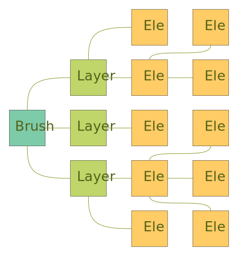
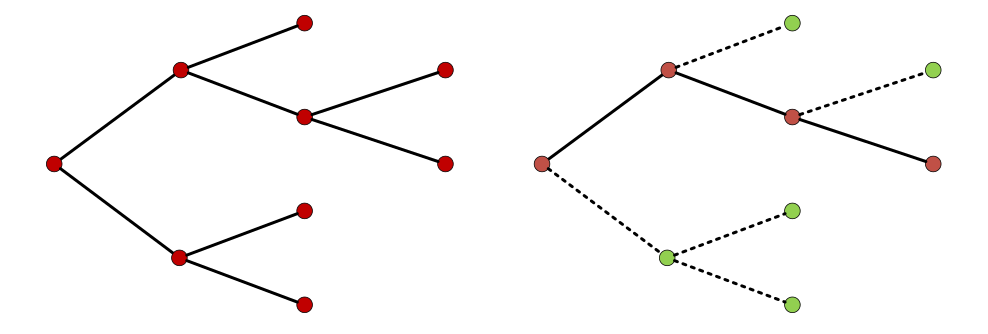
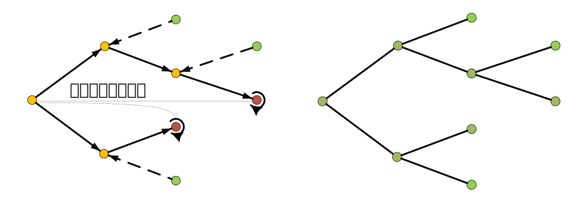

# Brush.js

Brush.js是一个绘制canvas的JavaScript框架。

* **组件化** 和React非常相似，你可以创建拥有各自状态的组件，每个组件只需要专注于自身的绘图逻辑，再由这些组件构成更加复杂的 UI。

* **高性能** Brush对绘图的细节做了大量优化，将多组件绘图的时间复杂度从O(n)降到了O(log(n))，你可以放心的交给Brush。

* **响应式** Brush是数据驱动的，当数据更新时，Brush会自动更新相关的部分组件。在设计好组件的绘图逻辑之后，你只需要关注于数据逻辑部分。

<br/>

## 📦 安装

### 使用 `<script>` 引用

```html
<div id="root"></div>

<script src="xxx/brush.js"></script>
```

<br/>

## 🧲 使用

我们以制作一个俄罗斯方块游戏为例。首先你需要创建一个Brush实例，并且传入尺寸 w 和 h 以及绑定的元素root。

```javascript
const brush = new Brush({
  w: 300,
  h: 600,
  root: document.getElementById('root')
})

// 如果后面的设置一切就绪，使用render方法就可以绘制
// brush.render()
```

为了书写简便，在Brush中的宽度width、高度height、左距离left、上距离top分别被简化成了w、h、x、y。

<br/>

### 图层

在Brush中存在图层的概念。从本质上，一个图层就是一个独立的canvas元素，这是为了应对复杂的绘图场景，各个图层在绘制时保持互相不干扰，同时也可以使用webwoker多线程渲染进行优化。

总之，一个图层是一个绘制的基本单位。我们首先需要创建一个图层。

```javascript
const layer = brush.createLayer({
  style: {
    backgroundColor: 'white',
    w: 300,
    h: 600,
    x: 0, // 默认是0
    y: 0  // 默认是0
  },
  // 根级组件
  el: new Container({
    w: 300,
    h: 600,
    backgroundColor: '#ddd'
  })
})
```

你需要为图层指定style样式，如果不指定，那么图层将会默认占满整个Brush画板，背景默认为透明。

你可能注意到了，我们设置了一个el属性，同时指定了一个入口组件，图层将会以这个组件开始，逐渐渲染整个组件树。当然，你也可以指定多个入口组件，通过数组传入多个组件即可。

<br/>

### 组件

在Brush中，**一切皆是组件**，组件是构成整个复杂图像的基本单位。在组件中，我们将数据层和视图层进行了分离，在设置好了绘制模板之后，你只需要专注于数据业务逻辑即可。同时，每个组件将维护一个属于自己的offscreenCanvas，用于将自己的视图缓存下来，这也是Brush高效的原因之一。

Brush组件和React组件长得非常相似，本框架吸收了许多React的思想。因此，对于React的使用者来说，你可能使用起来非常熟悉。

我们首先来创建一个方块组件，为后面的俄罗斯方块游戏打下基础。

```javascript
class Box extends BrushElement {
  constructor(props) {
    super(props);
    // 组件的默认属性
    this.defaultProps = {
      w: 50,
      h: 50,
      border: 5
    }
  }
  // 绘图的部分放在这里
  paint() {
    this.ctx.fillStyle = this.props.bg;
    let border = this.props.border;
    /**
     * 以下四个属性的两种获取方法是等同的
     * this.w === this.props.w
     * this.h === this.props.h
     * this.x === this.props.x
     * this.y === this.props.y
     * 这是个简单的语法糖，简化对常用属性的访问
     * 另外，brush支持使用百分比进行布局
     */
    this.ctx.rect(border , border, '95%', this.h);
  }
}
```

如何在组件中引用其它的组件呢？我们以方块“田”为例。

```javascript
class Tian extends BrushElement {
  constructor(props) {
    super(props);
    this.defaultProps = {
      w: 100,
      h: 100
    }
  }
  /**
   * 指定需要用到的子组件
   * 一定要命名为elMap，不支持自定义
   * 组件实例名可以自定义，访问方式为: this.el.box
   */
  elMap = {
    box: new Box({
      bg: 'black',
      border: 5
    })
  };

  paint() {
    // 注意是el不是elMap
    // 在这里可以对子组件传参
    this.el.box({
      x: 0,
      y: 0
    })

    this.el.box({
      x: 50
    })

    this.el.box({
      x: 0,
      y: 50
    })

    this.el.box({
      x: 50
    })
  }
}
```

现在我们有了一个“田”字组件，接下来创建一个容器吧！
我们通过一些数据让方块动起来。

```javascript
class Container extends BrushElement {
  constructor(props) {
    super(props);
    // 设置内部状态
    this.state = {
      i: 0
    }
  }

  elMap = {
    tian: new Tian({
      x: 0,
      y: 0
    })
  };

  // 生命周期钩子，在组件被初始化后执行函数
  created() {
    // 每隔一秒将i自增
    setInterval(() => {
      this.setState({
        i: this.state.i + 1
      })
    }, 1000);
  }

  paint() {
    // 我们需要先清除一下画布
    this.clear();
    this.el.tian({
      y: this.state.i * 10
    })
  }
}
```

怎么样，是不是“有那味了”，一切都和react那么像，你只需要通过setState更新数据，Brush会自动对相关组件进行重绘，十分简单易用。

接下来，你需要按下启动键，组件树就开始绘制了。

```javascript
brush.render();
```

<br/>

## 📚 核心概念

### 组件

组件是Brush中核心的概念，你只需要将目标细化分解成一个个组件，就能轻松的构建复杂的图像。

Brush的每一个组件都维护了一个私有的offscreenCanvas，用于保存自己的视图状态，只有在必要更新时，组件才会进行重绘。

组件允许嵌套其它子组件，你可以在绘制函数`paint`中指定子组件的使用时机，你也可以在组件外部进行指定。

```javascript
class Demo extends BrushElement {
  // 指定你需要的组件们
  elMap = {
    box: new Box({
      // ... 初始化参数
    })
  };

  constructor(props) {
    super(props);
  }

  paint() {
    //... 绘制逻辑
    this.el.box({
      // ... 传递参数
    })
  }
}
```

注意，`this.el.name`获取的是一个控制器函数，而不是组件实例本身。其功能是传递新的参数并通知更新，在子组件绘制之后，自动采集其canvas内容，函数返回值是组件实例本身。而`this.elMap.name`才能直接获取到组件实例本身。

你可能需要一个现成的组件上进行补充，或者以一个组件为背景快速创建图形，你可以在外部指定子组件。

```javascript
class Demo extends BrushElement {
  elMap = {
    // ...
    box1: new Box(),
    box2: new Box()
  }
  // ...
  paint() {
    this.el.box({
      // ... 传递参数
    }).addChild([
      this.elMap.box1,
      this.elMap.box2
    ])
  }
}
```

<br/>

### 绘图扩展

（进行中）Brush对canvas绘制API进行了一系列的补充，其简化了绘制复杂度，扩增了一系列常用的绘图功能，同时你也拥有完全的原生canvas API。

**Brush在绘制时允许你使用百分比、vw、vh等实用的动态参数。**

#### `ctx.rect(x, y, w, h)`

绘制矩形

#### `ctx.circle(x, y, r)`

绘制圆

#### `ctx.plot(X: number[], Y: number[])`

（计划）快速绘制折线图

#### `ctx.smooth(X: number[], Y: number[])`

（计划）通过三次样条插值快速绘制曲线

... 待补充

<br/>

### 动画

...

### 事件

Brush中的父子组件通信可以使用props进行。
...

### 界面交互

...

### store

...

### 状态提升

...

<br/>

## 💡 深入原理

### 组件树

<div align=center></div><br/>

父子组件之间是一对多的关系，每个子组件同时拥有自己的子组件，最终形成了一个组件树。同时，每一个组件都自行维护了一个属于自己的offscreenCanvas，只有在有必要更新时，才会自行进行重绘，更新自己的canvas。

也就是说，当一个组件在重绘的时候，自己的每一个子组件都会根据情况（比如props是否有变动、变动属性是否被依赖、自身状态是否过期等）判断自己是否需要重绘，如果不需要则直接返回自己的canvas内容，而父级组件本身只需要拿到这些内容进行绘制。

<div align=center>
  
</div><br/>

这样一来，比起将所有的组件都无差别的进行重绘，Brush只需要对某一条路线进行重绘就可以了，时间复杂度从O(n)降低到了O(log(n)),这也就是为什么Brush高效的原因。

<br/>

### 更新策略

Brush的更新策略非常值得一说。早期在设计Brush的架构的时候，Brush采用的是一种自下向上、反向传播通知的更新策略。

首先要明确的一点是，父组件完全依赖于子组件的内容，如果子组件的内容不是最新的，那么父级组件的绘制是完全无效的。所以Brush早期的策略是：

1. 每个组件都维护一个内部状态state，当使用setState更新数据时，Brush使用requestAnimationFrame将绘制函数放到异步队列，同时多次数据更新会取消之前的绘制任务，这样一来，可以只在下一个动画帧前仅执行一次绘制函数。

2. 当子组件更新时，子组件会进行自我重绘，在那之后反向通知父组件，父组件根据所有子组件当前的内容进行重绘，接着继续向上传播，直到根级组件被完全更新。

这样的策略看起来十分完美，但是实际上存在几个问题。

> 一个组件只有在其被更新完毕之后才能进行反向传播，因为父级组件提前进行更新是没有意义的。由于绘制任务是异步的，一个动画帧仅能执行一次，也就是说，只有等到一个动画帧绘制完毕之后才会通知父级进行更新，一帧仅能反向传播一个单位。

这会带来什么问题呢？我们假设在组件树的不同部位的两个子组件A、B同时（或者说在同一个主任务中）进行了数据更新，其最近的公共父组件为F。由于A、B在组件树里面的深度不一样，而反向传播的速度为 1层/帧，也就是说A、B到达父组件的顺序不一样！尽管A、B是同时更新的。最终父级组件F被分别更新了2次，这就带来了性能浪费。

父级组件非常依赖子组件的内容，所以渲染顺序十分重要，如果在子组件内容不是最新时，父组件进行绘制是完全无效的。由于子组件的反向传播时间取决于在树中的深度，所以绘制顺序难以控制。

同时，当一个组件树的路径非常长时，可能会导致需要传播许久才能达到根节点。

那么如果取消对绘制函数的异步处理呢？假设父子组件同时进行更新，父级组件会进行两次绘制，同时在子组件未更新时父组件的绘制是浪费的。所以我们需要转变思路，改为从正向传播更新，最终Brush采取了下面的策略。

<br/>

#### Brush的策略

<div align=center>
  
</div><br/>

1. 每个子组件更新数据之后，直接向根级元素（图层）发送更新请求，图层收集来自各个组件的更新请求，并且把来自于同一个组件的请求进行去重，只保留一个。

2. 图层每次收到更新请求后，利用requestAnimationFrame执行一个异步函数（见3），多次收到更新将会取消异步任务，重新执行异步函数。

<div align=center>
  
</div><br/>

3. 在下一个动画帧之前，图层分析所有发起更新请求的子组件，得到从根组件到请求子组件的**更新链**，并且将更新链上所有的组件标记为 **过期**。

4. 由根组件开始向下发起渲染请求，每个组件在绘制时向子组件**索要**最新的canvas内容。如果子组件的状态为未过期，且props未发生有效变化，那么直接向父组件交付自己的canvas，不进行重绘；如果子组件已过期，那么就会强制进行重绘，同时也向自己的子组件索要最新内容，对于每一个子组件都重复上述的内容。这样一来，最终所有的组件都变成了最新状态。

一次整体的更新是在一次主任务中执行的，从上至下向子组件索要更新，这能保证每个组件的渲染顺序都是正确的，且最多只被绘制了一次，直接跳过无需更新的组件，所有问题都迎刃而解。